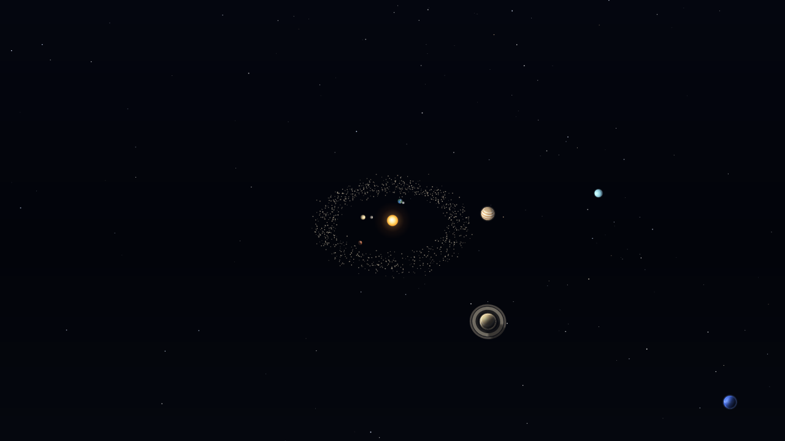

# Solar System — screensaver și fundal live



> **English:** a 3D solar system written from scratch in a single offline HTML file
> (Canvas 2D, no WebGL, no libraries), hosted by a small GTK3 + WebKit2GTK wrapper so it
> can run as a **live desktop wallpaper** or as a **MATE screensaver theme**.
> Real Keplerian orbital elements, physically-based illumination, no external assets.
> Docs are in Romanian; the code and its comments are in English.
>
> **Status:** the live-wallpaper role is stable and in daily use; the MATE screensaver
> theme is **experimental** — the daemon does not launch it on MATE 1.26.2 yet (see the
> status section below and `MANIFEST.md`).

Simulare 3D a sistemului solar într-un singur fișier HTML (Canvas 2D, offline, fără
librării), rulată de o gazdă nativă GTK/WebKit fie ca **temă de screensaver**, fie ca
**fundal live pe desktop**. Ghidul complet e mai jos; începe cu:

- `MANIFEST.md` — ce fișiere există, ce s-a instalat unde, cum se verifică, ce dependențe sunt
- `CHANGELOG.md` — ce s-a construit, ce a eșuat și de ce (cu dovezi)
- `verify.sh` — verificare de sănătate: `./verify.sh`

## Pornire rapidă

```sh
./install-solar-screensaver.sh install        # copiază în ~/.local + scrie configurația
./solar-wallpaper.sh --print                  # ce ar porni (nu deschide nimic)
./solar-wallpaper.sh &                        # pornește fundalul live
pkill -f solar-webkit.py                      # oprește-l
./verify.sh                                   # verifică tot
```

## Stare (2026-09-19)

| componentă | stare |
|---|---|
| simularea `solar-system-3d.html` | ✅ **funcțională** — orbite kepleriene reale, iluminare calculată, inele, centură de asteroizi; 60 fps la 1366×768 și 390×844; zero erori JS |
| fundal live `solar-wallpaper.sh` | ✅ **stabil, în uz zilnic** — monitorul 2, fără orbite/etichete, pornire automată la login |
| screensaver `solar-saver.sh` + tema MATE | ⚠️ **experimental (WIP)** — vezi mai jos |

### Screensaver: ce e verificat și ce nu

**Verificat:** gazda desenează în fereastra dată de daemon prin contractul
`XSCREENSAVER_WINDOW` (reparentare X11, nu `Gtk.Plug`), potrivește visualul ferestrei
gazdă, are handler X non-fatal care loghează în loc să moară, iar rulat manual
(`solar-saver.sh`) pornește corect fullscreen.

**Neverificat / nu funcționează pe acest sistem:** pe MATE 1.26.2, `mate-screensaver`
**nu lansează tema** la activare — jurnalul `~/.cache/solar-screensaver.log` rămâne gol,
deși tema e instalată system-wide, are alias pentru ID-ul din `gsettings` și `--root`
în `Exec`. Rezolvarea temelor în daemon se face la activare, deci diagnosticul cere
capturarea ieșirii de debug **în timpul activării** (rețetă în `MANIFEST.md`,
secțiunea „Depanare screensaver").

Până atunci: **folosește fundalul live**; screensaver-ul rămâne în repo ca punct de
plecare documentat, nu ca funcție gata de folosit.

Configurația fundalului: `~/.config/solar-screensaver/wallpaper.conf`
(arie, viteză, straturi, orbite, etichete) — implicit pe monitorul 2, fără orbite și
fără etichete.

---

# Solar System ca screensaver / fundal live pe Linux (X11 + MATE)

Trei fișiere noi lângă `solar-system-3d.html`:

| fișier | rol |
|---|---|
| `solar-webkit.py` | gazda nativă GTK3 + WebKit2GTK care afișează pagina: fereastră full-screen (screensaver), fereastră lipită sub iconițe (fundal live) sau embedded într-un ferestru dat (`--wid`, pentru xwinwrap). Are și `--selftest` (randare off-screen) și `--geometry-check` (măsoară geometria reală, invizibil) |
| `solar-saver.sh` | intrarea de screensaver: pornește gazda în modul saver și ține panoul aprins (salvează și restaurează starea DPMS) |
| `solar-wallpaper.sh` | fundalul live: un canvas peste toate monitoarele (`SOLAR_SPAN=1`) sau câte unul pe monitor (`SOLAR_SPAN=0`) |
| `install-solar-screensaver.sh` | copiază totul în `~/.local/bin/solar-screensaver/` și înregistrează tema + autostartul |

## Instalare

```sh
cd ~/deepseek_harness_workspace
./install-solar-screensaver.sh install      # scrie doar în $HOME
./install-solar-screensaver.sh status       # ce e instalat
./install-solar-screensaver.sh uninstall    # dezinstalare curată
```

Apoi:

1. **Test imediat, fără să aștepți timerul de idle:**
   ```sh
   ~/.local/bin/solar-screensaver/solar-saver.sh     # Ctrl+C pentru oprire
   ```
2. **Înregistrarea ca temă:** deschide `mate-screensaver-preferences` și bifează
   „Solar System". Dacă nu apare în listă, instalează intrarea la nivel de sistem:
   ```sh
   sudo cp ~/.local/share/applications/screensavers/solar-system.desktop \
            /usr/share/applications/screensavers/
   ```
   (Meniu-ul `mate-screensavers.menu` folosește `<DefaultAppDirs/>`, care include
   `~/.local/share/applications`, deci ar trebui să fie găsită și din `$HOME`.)
3. **Fundal live:** rulează o dată `~/.local/bin/solar-screensaver/solar-wallpaper.sh`,
   iar pentru pornire automată la login schimbă în
   `~/.config/autostart/solar-wallpaper.desktop` linia
   `X-GNOME-Autostart-enabled=false` în `true` (sau folosește
   „Applications → Preferences → Startup Applications"). Intenționat lăsat
   dezactivat, ca să nu-ți schimbe sesiunea fără acordul tău.

## Cum se comportă

- **Screensaver:** fereastră fără decorațiuni pe toate monitoarele, în stratul
  `below` — adică acoperă desktopul și iconițele, dar **dialogul de deblocare
  MATE rămâne deasupra**, deci îți poți tasta parola. mate-screensaver omoară
  procesul la prima tastă, iar scriptul restaurează DPMS-ul la ieșire.
- **Fundal live:** fereastră în stratul `desktop`, fără focus și **click-through**
  (`set_pass_through`), deci click-urile și click-dreapta ajung la desktop.
  Atenție însă: pe MATE, caja desenează fundalul **și iconițele în aceeași
  fereastră opacă**, deci un canvas pe tot ecranul acoperă și iconițele — vezi
  secțiunea de mai jos.
- **Mișcare:** în ambele moduri camera se rotește lent (o tură la ~9,5 minute)
  ca să nu se „ardă" panoul. Screensaver-ul face și un tur al corpurilor la
  fiecare 22 s (Soare → Mercur → … → Lună); fundalul live merge doar în drift,
  mai calm.

## Parametri utili

Pagina acceptă parametri în URL:

| parametru | efect |
|---|---|
| `?saver=1` | mod cinematic: fără panouri, cursor ascuns, drift + tur |
| `?saver=drift` | doar drift (folosit de fundalul live) |
| `&tour=0` | fără tur |
| `&speed=6` | viteză inițială în zile/secundă (poate fi negativă) |
| `&quality=2` | pornire la o calitate fixă (0 = maximă … 3 = redusă) |
| `&fps=30` | limitează desenarea la 30 de cadre/s; simularea continuă normal. Fundalul live folosește 30 fps implicit (≈ jumătate din CPU față de 60); `FPS=0` în config = nelimitat |

Gazda are propriile opțiuni:

```sh
solar-webkit.py --help
solar-webkit.py --mode saver --stack above         # peste tot (demo manual)
solar-webkit.py --mode wallpaper --stack below     # dacă iconițele caja ies deasupra
solar-webkit.py --monitor 1 --mode wallpaper       # doar al doilea monitor
solar-webkit.py --selftest                         # verifică randarea, fără fereastră
SOLAR_SPEED=2 SOLAR_SPAN=0 solar-wallpaper.sh      # mai rapid, câte un canvas/monitor
```

`--selftest` randează pagina off-screen (fără să apară nimic pe ecran), salvează
un PNG, afișează FPS-ul obținut de WebKit și eventualele erori JS — util când
ceva nu arată bine după o actualizare de sistem.

## Screensaver: cum funcționează (și de ce nu pornea)

mate-screensaver **nu dă argumente** temelor. Exportă variabila de mediu
`XSCREENSAVER_WINDOW=<id>` și așteaptă ca tema să deseneze *în acea fereastră* —
contractul xscreensaver. Prima versiune ignora variabila și își deschidea propria
fereastră full-screen în stratul `below`, care rămânea în spatele ferestrei
opace a daemonului: de aceea „nu se inițializa".

Ce face acum gazda:

- dacă `XSCREENSAVER_WINDOW` este setată, își **reparentează** fereastra în cea
  dată (`XReparentWindow` + `XMoveResizeWindow` + `XMapWindow` prin libX11,
  exact ca hack-urile xscreensaver și ca xwinwrap) și îi urmărește dimensiunea;
- `Gtk.Plug` a fost eliminat: vorbește protocolul XEMBED, iar cu o fereastră
  străină rămâne **nemapată** (9×16 px, invizibil) — verificat;
- rulat manual, fără variabila de mediu, pornește ca fereastră full-screen proprie
  (util pentru teste din terminal).

**Test rapid fără să aștepți timerul:** în `mate-screensaver-preferences`,
butonul **Preview** folosește exact același mecanism — animația trebuie să apară
în căsuța de previzualizare.

Dacă totuși nu pornește, jurnalul spune de ce:

```sh
tail -5 ~/.cache/solar-screensaver.log
# 2025-09-19 16:02:11  start pid=1234 args=[] XSCREENSAVER_WINDOW=0x2c00007
# 2025-09-19 16:02:41  stop  pid=1234 rc=0
```

## Dacă vezi doar o parte din ecran (rezolvat)

Simptom: animația apare doar într-un colț, pe ~1/8 din ecran.

Cauză: `Gtk.Window.resize()` este **ignorat** pentru o fereastră
`set_resizable(False)` înainte de mapare — fereastra apare la dimensiunea
implicită (câteva sute de pixeli), iar Marco o plasează pe monitorul unde se
află cursorul. Reparat: dimensiunea se cere acum cu `set_default_size()` (care
devine size-hint la mapare) plus un `move_resize()` direct pe fereastra Gdk.

A doua capcană, tot Marco: pentru ferestrele normale el ignoră poziția cerută și
folosește monitorul cursorului. De aceea:

- **implicit** (fără `--monitor`) se folosește o singură fereastră peste toate
  monitoarele — 3840×1080 la tine, verificat;
- `--monitor N` comută automat pe stratul `desktop`, singurul pentru care Marco
  respectă poziția cerută (verificat: monitor 0 → 1920×1080+0+0, monitor 1 →
  1920×1080+1920+0). Dialogul de blocare rămâne oricum deasupra.

Verificare oricând, fără să apară nimic pe ecran (fereastra se mapează cu
opacitate 0):

```sh
solar-webkit.py --geometry-check --mode saver
solar-webkit.py --geometry-check --mode wallpaper --monitor 1
# → geometry-check: ... -> window (x=0, y=0, width=3840, height=1080) | page sees 3840x1080 dpr=1
```

## Iconițele de pe desktop (limită a desktopului, nu a animației)

Verificat pe sistemul tău: caja ține fundalul și iconițele în **aceeași fereastră**
(„Desktop", 3840×1080, `_NET_WM_WINDOW_TYPE_DESKTOP`, **adâncime 24 biți**,
**fără sub-ferestre**). De aici:

- orice fereastră **deasupra** ei acoperă fundalul *și* iconițele;
- orice fereastră **dedesubt** devine invizibilă (fundalul e opac, fără canal alfa).

Deci „animație pe tot ecranul" și „iconițe pe desktop" se exclud reciproc. Ai
patru variante reale, toate testate:

1. **Ca screensaver** (recomandat pentru ecran complet): iconițele rămân intacte
   cât lucrezi, animația apare când ecranul e inactiv — `mate-screensaver-preferences`.
2. **Fundal doar pe monitorul din dreapta.** La tine toate cele 87 de iconițe sunt
   pe monitorul stâng (x = 64…1000), deci pe dreapta nu acoperă nimic:
   ```sh
   SOLAR_AREA=1920x1080+1920+0 ~/.local/bin/solar-screensaver/solar-wallpaper.sh
   ```
3. **Fundal pe o bandă din monitorul stâng, în dreapta iconițelor** (824×1080 lângă
   marginea din dreapta a monitorului):
   ```sh
   SOLAR_AREA=824x1080+1096+0 ~/.local/bin/solar-screensaver/solar-wallpaper.sh
   ```
4. **Ecran complet, dar fără iconițe pe desktop** (animația devine tot desktopul):
   ```sh
   gsettings set org.mate.background show-desktop-icons false   # înapoi: true
   ```

Pentru pornire automată cu o zonă anume, scrie variabila direct în autostart:

```
Exec=env SOLAR_AREA=1920x1080+1920+0 ~/.local/bin/solar-screensaver/solar-wallpaper.sh
```

## Capcane și rezolvări

| simptom | cauză / rezolvare |
|---|---|
| Ecranul se stinge după ~30 min peste animație | `sleep-display-ac = 1800`. Screensaver-ul face `xset -dpms` cât rulează; pentru fundalul live setează „Turn off display: Never" în MATE |
| Se vede dialogul de blocare, nu animația | `lock-delay = 0` + `lock-enabled = true`. Animația e fundalul; pentru a o vedea singură: `gsettings set org.mate.screensaver lock-enabled false` (sau mărește `lock-delay`) |
| Iconițele de pe desktop sunt acoperite | normal pe MATE: caja le desenează în aceeași fereastră opacă cu fundalul. Vezi „Iconițele de pe desktop" mai sus |
| Animația nu apare deloc în „Screensaver Preferences" | instalează intrarea system-wide (comanda `sudo cp` de mai sus) |
| Tema e în listă dar ecranul rămâne gol | versiune veche a gazdei, care ignora `XSCREENSAVER_WINDOW` — rulează din nou `./install-solar-screensaver.sh install`; verifică `tail ~/.cache/solar-screensaver.log` |
| Vreau să opresc fundalul live | `pkill -f solar-webkit.py` sau dezactivează autostartul |
| Vreau și pe al doilea monitor, separat | `SOLAR_SPAN=0 ./solar-wallpaper.sh`; pentru screensaver: `solar-saver.sh` cu `--monitor 0/1` (folosește automat stratul desktop) |
| Vreau o zonă anume, nu tot ecranul | `SOLAR_AREA=WxH+X+Y` (ex. `1920x1080+1920+0`) sau direct `solar-webkit.py --area 824x1080+1096+0` |
| Animația apare doar într-un colț | versiune veche a gazdei — rulează din nou `./install-solar-screensaver.sh install` |

## Compatibilitate

Testat pe sistemul tău: WebKitGTK **2.52**, GTK 3, X11, MATE, 2 × 1920×1080
(fereastră unică de 3840×1080). Randarea off-screen a paginii trece fără erori
JS, în ambele moduri. FPS măsurat în sandbox (fără accelerare GL) ≈ 35–38 la
1920×1080; în sesiunea ta reală WebKit are accelerare hardware, iar pagina are
și scaler adaptiv de rezoluție.

**Wayland:** `mate-screensaver`/`xscreensaver` și ferestrele de tip desktop nu
funcționează acolo. Rețeta generală: `swayidle`/`hypridle` care pornește
`cage -- solar-webkit.py --mode saver` (sau `firefox --kiosk`) și îl oprește la
`resume`. Gazda WebKit nu depinde de MATE, doar de X11 pentru `--wid`/straturi.

---

## Licență

MIT — vezi `LICENSE`. Simularea folosește elemente orbitale reale (J2000, JPL), dar
scalele de afișare sunt comprimate ne-liniar pentru vizibilitate; vezi panoul de
informații din pagină și `MANIFEST.md`.
